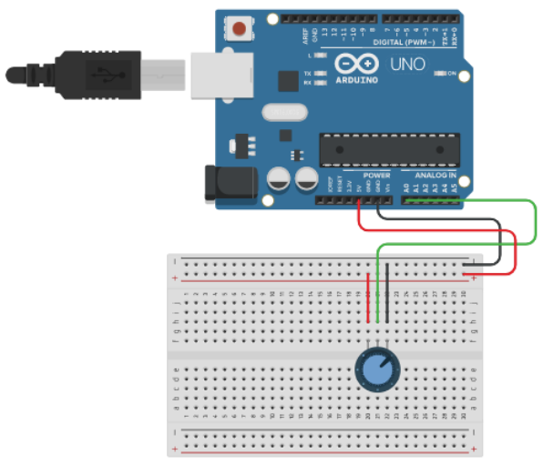

# Communicating Arduino/Node.js

- Created: `yarn init -y`
- Dependencies: `yarn add dotenv serialport socket.io`
- Start Dev: `yarn start:dev`
- Tools: `VSCode/Yarn/Node`
[Source Link](https://codeadam.ca/learning/arduino-to-nodejs)

